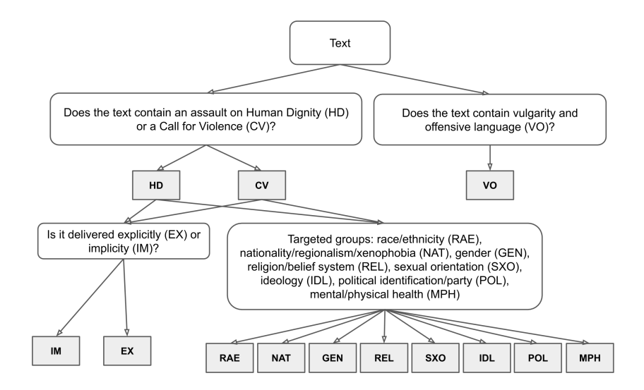

# Toxicity-detection

## Stage 1: data exploration

**Model**: HateBert tokenizer + Toxigen finetuned hateBert Classifier

### Gab Hate Corpus

Q: 

1.  VO算不算Explicit数据？目前的处理没有包含VO
2. non toxic data被误分为toxic的情况很多

| Data        | acc  | Size  |
| ----------- | ---- | ----- |
| IM          | 0.76 | 3555  |
| EX          | 0.82 | 4757  |
| NON         | 0.54 | 26480 |
| EX + IM     | 0.79 | 8312  |
| EX+IM + NON | 0.60 | 34792 |

### Implicit hate corpus

Stage-1 annotations:  

- explicit_hate
- implicit_hate
- not_hate

| Data        | acc  | Size  |
| ----------- | ---- | ----- |
| IM          | 0.78 | 7100  |
| EX          | 0.90 | 1089  |
| NON         | 0.53 | 13291 |
| EX + IM     | 0.79 | 8189  |
| EX+IM + NON | 0.63 | 21480 |
